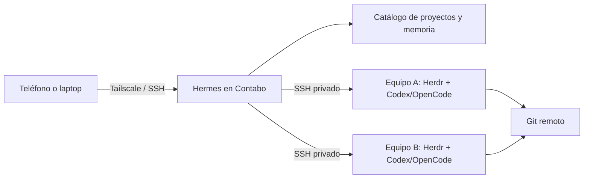

# Arquitectura de Hermes persistente

## Objetivo

Crear un agente general y persistente que conozca los proyectos de Deiv,
coordine trabajo desde el servidor de Contabo y delegue tareas de desarrollo a
agentes que se ejecutan en los equipos donde viven los repositorios.

Hermes es el planificador y la memoria de alto nivel. Herdr es el runtime de
terminales y sesiones persistentes. Codex y OpenCode son los agentes que hacen
el trabajo dentro de cada repositorio.



## Componentes y responsabilidades

| Componente | Ubicación | Responsabilidad |
|---|---|---|
| Hermes | Contabo, Docker | Contexto, planificación, memoria y seguimiento de tareas |
| Herdr | Cada equipo | Mantener terminales y sesiones de agentes activas |
| Codex/OpenCode | Cada equipo | Editar, probar y revisar los repositorios locales |
| Tailscale + SSH | Todos los nodos | Red privada y transporte entre dispositivos |
| Git | Remoto | Fuente de verdad de código y colaboración |

Herdr puede mostrar y mantener en una misma interfaz las sesiones de varias
máquinas conectadas por SSH. Cada máquina conserva su propio servidor Herdr y
sus procesos. Actualmente, la automatización de agentes de Herdr se limita a
un servidor a la vez; Hermes debe coordinar entre máquinas conectándose por
SSH a cada una e invocando el CLI/local socket de Herdr.

## Conexión de dispositivos

Los equipos domésticos no suelen aceptar conexiones entrantes desde Contabo.
Tailscale crea una red privada entre el servidor, laptops, escritorio y móvil,
por lo que Hermes puede alcanzar a cada equipo por SSH sin publicar puertos en
Internet.

Cada dispositivo tendrá:

1. Tailscale instalado y conectado.
2. Acceso SSH con una clave dedicada a Hermes, no la clave personal.
3. Herdr instalado y ejecutándose como el usuario dueño de sus repositorios.
4. Codex y/o OpenCode autenticados localmente.

Un puente inicial puede ser un comando SSH que invoque Herdr en el equipo:

```text
Hermes -> SSH privado -> herdr agent prompt <agente> <tarea>
```

La primera validación debe usar un único equipo y un único repositorio.

## Datos y persistencia

La imagen de Hermes no conserva estado. `data/hermes/` contiene configuración,
sesiones, memoria, skills y credenciales configuradas en Hermes. Se excluye de
Git y debe respaldarse cifrado.

`workspace/` está reservado para artefactos que Hermes produzca o reciba. Los
repositorios de trabajo no se montan por defecto: continúan en los dispositivos
que los usan.

Para migrar el servicio se detienen los contenedores, se copian `data/hermes/`
más `.env`, se restaura el conjunto en otro clon y se vuelve a ejecutar Compose.

## Permisos

El servidor de pruebas permite que Deiv y Charlie usen `sudo` y Docker. El
contenedor inicial no recibe el socket Docker ni directorios completos del host:
esa capacidad no es necesaria para que Hermes converse y mantenga memoria.

Montar `/var/run/docker.sock` daría a Hermes control efectivo de root sobre
Contabo. Si se decide habilitarlo después, se hará como un cambio explícito y
documentado. El acceso a cada computadora es independiente: una clave SSH del
orquestador permitiría ejecutar acciones como el usuario remoto al que se le
autorice.

## Conocimiento y recuperación de contexto

Los Markdown y Git siguen siendo la fuente de verdad humana y versionable. La
memoria breve de Hermes guarda preferencias y decisiones resumidas. El estado
operativo (proyectos, dispositivos, tareas y ejecuciones) deberá vivir en una
base relacional.

Una base vectorial será un índice derivado para recuperar fragmentos relevantes
sin enviar repositorios completos al modelo. No reduce tokens por sí sola: los
reduce cuando devuelve pocos fragmentos pertinentes.

La evolución prevista es:

1. Markdown, manifiesto de proyectos y memoria nativa de Hermes.
2. PostgreSQL para el catálogo y estado estructurado.
3. `pgvector` en el mismo PostgreSQL para búsqueda semántica.
4. Qdrant solo si el volumen o las necesidades de búsqueda superan a pgvector.

Cada fragmento indexado debe registrar proyecto, repositorio, rama, commit,
ruta, tipo, hash e instante de indexación. Hermes usará búsqueda híbrida:
búsqueda textual para símbolos y errores; vectores para decisiones, conceptos y
relaciones entre proyectos. Antes de editar, siempre leerá el archivo y commit
reales, no solo el resultado del índice.

No se indexarán secretos, `.env`, dependencias, binarios, archivos lock ni
artefactos generados. Los resúmenes de agentes deben entrar al índice solo si
son aprobados o proceden de fuentes versionadas.

## Fases de implementación

1. Desplegar Hermes persistente y completar el asistente de proveedor.
2. Acceder al dashboard mediante túnel SSH o Tailscale.
3. Conectar un primer equipo por Tailscale y SSH; validar una sesión Herdr.
4. Crear el manifiesto de proyectos y el puente Hermes -> SSH -> Herdr.
5. Agregar PostgreSQL/pgvector después de validar el flujo con repositorios
   reales.
