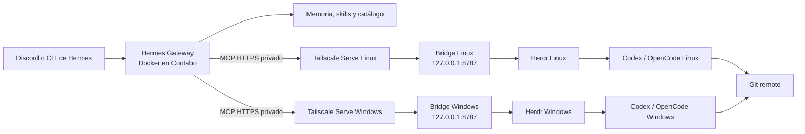

# Arquitectura de Hermes persistente

## Objetivo

Crear un agente general y persistente que conozca los proyectos de Deiv,
coordine trabajo desde el servidor de Contabo y delegue tareas de desarrollo a
agentes que se ejecutan en los equipos donde viven los repositorios.

Hermes es el planificador y la memoria de alto nivel. Herdr es el runtime de
terminales y sesiones persistentes. Codex y OpenCode son los agentes que hacen
el trabajo dentro de cada repositorio.



## Componentes y responsabilidades

| Componente | Ubicación | Responsabilidad |
|---|---|---|
| Hermes | Contabo, Docker | Contexto, planificación, memoria y seguimiento de tareas |
| Herdr | Cada equipo | Mantener terminales y sesiones de agentes activas |
| Codex/OpenCode | Cada equipo | Editar, probar y revisar los repositorios locales |
| Tailscale + SSH | Todos los nodos | Red privada y transporte entre dispositivos |
| Git | Remoto | Fuente de verdad de código y colaboración |

Herdr puede mostrar y mantener en una misma interfaz las sesiones de varias
máquinas conectadas por SSH. Cada máquina conserva su propio servidor Herdr y
sus procesos. Su CLI de automatización sólo puede controlar el servidor local
cuando se ejecuta desde un panel que Herdr administra (`HERDR_ENV=1`). Una
shell SSH externa, incluido Hermes en Contabo, no cumple esa condición y no
debe usar `herdr agent prompt` para manejar la sesión de un usuario.

## Conexión de dispositivos

Los equipos domésticos no suelen aceptar conexiones entrantes desde Contabo.
Tailscale crea una red privada entre el servidor, laptops, escritorio y móvil,
por lo que Hermes puede alcanzar a cada equipo por SSH sin publicar puertos en
Internet.

Cada dispositivo tendrá:

1. Tailscale instalado y conectado.
2. Acceso SSH con una clave dedicada a Hermes, no la clave personal.
3. Herdr instalado y ejecutándose como el usuario dueño de sus repositorios.
4. Codex y/o OpenCode autenticados localmente.

El puente correcto es un proceso local de cada equipo, iniciado dentro de un
panel administrado por Herdr. Ese proceso recibe tareas autenticadas desde
Hermes por MCP HTTPS privado sobre Tailscale y, al
tener `HERDR_ENV=1`, usa el CLI de Herdr para crear paneles, iniciar Codex u
OpenCode y leer su estado. Hermes usa SSH para verificar salud y administrar
el puente, pero no para controlar directamente la sesión Herdr del usuario.

```text
Hermes -> MCP HTTPS privado -> bridge local en panel Herdr
       -> CLI Herdr local -> Codex / OpenCode
```

Como alternativa temporal, Hermes puede ejecutar un comando no interactivo
por SSH (por ejemplo, `codex exec`) en un directorio explícito. Ese trabajo no
queda gestionado por una sesión Herdr, por lo que no sustituye al puente.

La primera implementación está en [`bridge/`](../bridge/). Es un servidor MCP
HTTP que escucha sólo en `127.0.0.1`, exige un token por nodo y permite una
lista explícita de proyectos. Tailscale Serve publica el endpoint privado con
HTTPS hacia Hermes. Linux está activo y registrado como `linux_deiv`. Windows
está registrado como `windows_deiv` y se recuperará cuando el equipo y su
bridge estén activos. Ambos empiezan sin proyectos autorizados.

## Red, claves y alcance

Tailscale une Contabo, Linux y Windows sin publicar SSH, Herdr ni el puerto
8787 en Internet. Cada bridge escucha sólo en `127.0.0.1:8787`; Tailscale Serve
termina HTTPS dentro del tailnet y reenvía exclusivamente a ese puerto local.
Hermes se autentica ante cada MCP con un token distinto, guardado fuera de Git.

| Ruta | Uso |
|---|---|
| Contabo → Linux/Windows | Comprobación, instalación y mantenimiento mediante una clave dedicada. No controla Herdr directamente. |
| Linux → Contabo | Abre el CLI de Hermes desde un panel Herdr con una clave dedicada. |
| Windows → Contabo | Abre el CLI de Hermes con la identidad SSH configurada por el usuario. |

El bridge no ofrece una shell arbitraria. Expone salud, proyectos autorizados,
inicio de Codex, estado del agente, envío de tarea y lectura de salida. Actúa
como el usuario local que posee el repositorio.

## Flujo de una tarea

1. Escribes a Hermes desde Discord o desde su CLI dentro de Herdr.
2. La skill `orquestar-herdr` consulta salud y proyectos del nodo adecuado.
3. Hermes llama a `linux_deiv` o `windows_deiv` por MCP sobre Tailscale.
4. El bridge controla Herdr localmente, inicia Codex y entrega la tarea.
5. El resultado vuelve por MCP y Hermes responde por el canal original.

## Inicio simplificado

En Linux, `~/hermes-herdr-bridge/open-orchestrator.sh`, ejecutado desde un
panel Herdr, crea un panel para el bridge y otro para el CLI de Hermes. Mantén
ambos vivos y usa `Ctrl+B`, luego `Q`, para desconectar sin detenerlos. Al
apagar un equipo, su bridge deja de responder y Hermes debe tratar ese nodo
como no disponible hasta que `node_health` vuelva a ser sano.

### Trabajo diario y cuentas de Codex

El bridge inicia todos los agentes Codex con `--no-daemon`. Cada panel es un
proceso independiente: evita el daemon compartido de Codex, que Windows no
permite iniciar desde una sesión elevada. Herdr y los paneles de desarrollo se
deben abrir como el usuario normal de Windows, nunca con "Ejecutar como
administrador".

Se pueden abrir dos sesiones Codex al mismo tiempo, una por cuenta. Cada
cuenta debe tener un `CODEX_HOME` distinto, porque allí Codex guarda su inicio
de sesión y sus sesiones. En Windows se prepara una vez desde PowerShell
normal:

```powershell
$env:CODEX_HOME = "$HOME\.codex-personal"
codex login

$env:CODEX_HOME = "$HOME\.codex-universidad"
codex login
```

Después, crea dos paneles de Herdr y en cada uno ejecuta una de estas líneas:

```powershell
$env:CODEX_HOME = "$HOME\.codex-personal"; codex --no-daemon
$env:CODEX_HOME = "$HOME\.codex-universidad"; codex --no-daemon
```

No se comparten tokens ni el historial entre ambas carpetas. El bridge MCP
actual usa la cuenta asociada al proceso con que se inició; una ampliación
posterior puede declarar perfiles de cuenta de forma explícita si Hermes debe
delegar a ambas.

Para reducir fricción, el flujo recomendado es local: abre los paneles Codex u
OpenCode directamente en Herdr para editar y probar. Hermes en Contabo queda
para arquitectura, prioridades, memoria y coordinación. El puente MCP se usa
cuando convenga delegar una tarea desde Hermes y no es un requisito para
programar.

## Diagnóstico de conectividad

Linux se usa desde redes de casa, trabajo y universidad. Algunas de esas redes
pueden bloquear o degradar Tailscale, sus relés DERP o SSH. Si Contabo recibe
`Connection timed out`, un MCP deja de responder o `tailscale ping` falla,
primero comprobar la red activa de Linux y probar otra red o un hotspot. No
reiniciar claves, bridges, puertos ni Tailscale Serve como primera reacción:
la configuración puede estar correcta aunque la red actual impida la ruta.

En Linux, las comprobaciones mínimas son:

```bash
tailscale status
tailscale ping hermes-contabo
sudo systemctl status ssh --no-pager
```

Cuando el nodo vuelva a aparecer en el tailnet, Contabo reintentará SSH y
Hermes recuperará el MCP al volver a estar disponible el bridge.

La primera validación debe usar un único equipo y un único repositorio.

## Datos y persistencia

La imagen de Hermes no conserva estado. `data/hermes/` contiene configuración,
sesiones, memoria, skills y credenciales configuradas en Hermes. Se excluye de
Git y debe respaldarse cifrado.

`workspace/` está reservado para artefactos que Hermes produzca o reciba. Los
repositorios de trabajo no se montan por defecto: continúan en los dispositivos
que los usan.

Para migrar el servicio se detienen los contenedores, se copian `data/hermes/`
más `.env`, se restaura el conjunto en otro clon y se vuelve a ejecutar Compose.

## Permisos

El servidor de pruebas permite que Deiv y Charlie usen `sudo` y Docker. El
contenedor inicial no recibe el socket Docker ni directorios completos del host:
esa capacidad no es necesaria para que Hermes converse y mantenga memoria.

Montar `/var/run/docker.sock` daría a Hermes control efectivo de root sobre
Contabo. Si se decide habilitarlo después, se hará como un cambio explícito y
documentado. El acceso a cada computadora es independiente: una clave SSH del
orquestador permitiría ejecutar acciones como el usuario remoto al que se le
autorice.

## Conocimiento y recuperación de contexto

Los Markdown y Git siguen siendo la fuente de verdad humana y versionable. La
memoria breve de Hermes guarda preferencias y decisiones resumidas. El estado
operativo (proyectos, dispositivos, tareas y ejecuciones) deberá vivir en una
base relacional.

Una base vectorial será un índice derivado para recuperar fragmentos relevantes
sin enviar repositorios completos al modelo. No reduce tokens por sí sola: los
reduce cuando devuelve pocos fragmentos pertinentes.

La evolución prevista es:

1. Markdown, manifiesto de proyectos y memoria nativa de Hermes.
2. PostgreSQL para el catálogo y estado estructurado.
3. `pgvector` en el mismo PostgreSQL para búsqueda semántica.
4. Qdrant solo si el volumen o las necesidades de búsqueda superan a pgvector.

Cada fragmento indexado debe registrar proyecto, repositorio, rama, commit,
ruta, tipo, hash e instante de indexación. Hermes usará búsqueda híbrida:
búsqueda textual para símbolos y errores; vectores para decisiones, conceptos y
relaciones entre proyectos. Antes de editar, siempre leerá el archivo y commit
reales, no solo el resultado del índice.

No se indexarán secretos, `.env`, dependencias, binarios, archivos lock ni
artefactos generados. Los resúmenes de agentes deben entrar al índice solo si
son aprobados o proceden de fuentes versionadas.

## Fases de implementación

1. Desplegar Hermes persistente y completar el asistente de proveedor.
2. Acceder al dashboard mediante túnel SSH o Tailscale.
3. Conectar un primer equipo por Tailscale y SSH; validar Herdr y Codex.
4. Crear el manifiesto de proyectos y el puente local de tareas de Hermes.
5. Agregar PostgreSQL/pgvector después de validar el flujo con repositorios
   reales.
